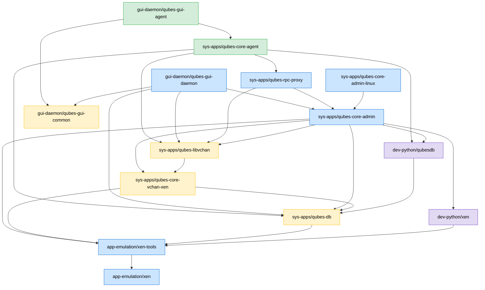

# Qubentoo Package Dependency Graph

Full build-order dependency tree for all packages in the overlay.
Two sections: **dom0** (the Xen host) and **domU / template** (guest VMs).

---

## DOM0 Packages

```
Gentoo stage3 (hardened/amd64/openrc)
│
├── app-emulation/xen  ◄─────────────────────────────────────────────┐
│     Xen hypervisor (no stubdom)                                    │
│     BDEPEND: sys-devel/bin86, sys-devel/dev86                      │
│                                                                    │
├── dev-python/xen  ─────────────────────────────────────────────────┤
│     Python bindings: xen.lowlevel, xen.xl, xenstore                │
│     RDEPEND: app-emulation/xen-tools                               │
│                                                                    │
├── app-emulation/xen-tools  ◄───────────────────────────────────────┤
│     xl, xenstore tools, xenstored, xenconsoled, xendomains          │
│     RDEPEND: app-emulation/xen                                     │
│     OpenRC: xenstored (sysinit) → xencommons (sysinit)             │
│             xenconsoled (default) → xendomains (default)           │
│                                                                    │
├── sys-apps/qubes-db  ──────────────────────────────────────────────┤
│     QubesDB C daemon (dom0 key-value store)                        │
│     RDEPEND: app-emulation/xen-tools                               │
│     OpenRC: qubes-db (default, after xenstored)                    │
│                                                                    │
├── dev-python/qubesdb  ─────────────────────────────────────────────┤
│     Python bindings for QubesDB                                    │
│     RDEPEND: sys-apps/qubes-db                                     │
│                                                                    │
├── sys-apps/qubes-core-vchan-xen ───────────────────────────────────┤
│     vchan transport over Xen shared memory (C library)             │
│     RDEPEND: app-emulation/xen-tools, sys-apps/qubes-db            │
│                                                                    │
├── sys-apps/qubes-libvchan ─────────────────────────────────────────┤
│     libvchan API (thin wrapper, packaged separately)               │
│     RDEPEND: sys-apps/qubes-core-vchan-xen                         │
│                                                                    │
├── sys-apps/qubes-core-admin ───────────────────────────────────────┤
│     qubesd — main dom0 admin daemon (Python)                       │
│     RDEPEND: qubes-db, qubes-core-vchan-xen, qubes-libvchan,       │
│              xen-tools, dev-python/qubesdb, dev-python/xen         │
│     OpenRC: qubesd (default, after qubes-db)                       │
│                                                                    │
├── sys-apps/qubes-core-admin-linux ─────────────────────────────────┤
│     Linux dom0 specifics: udev rules, qmemman helpers              │
│     RDEPEND: sys-apps/qubes-core-admin                             │
│     OpenRC: qubes-core (default, after qubesd)                     │
│                                                                    │
├── sys-apps/qubes-rpc-proxy ────────────────────────────────────────┤
│     qrexec policy daemon                                           │
│     RDEPEND: qubes-core-admin, qubes-libvchan                      │
│     OpenRC: qubes-rpc-proxy (default, after qubesd)                │
│                                                                    │
├── gui-daemon/qubes-gui-common ─────────────────────────────────────┤
│     Shared GUI protocol headers + libs (dom0 + domU)               │
│     RDEPEND: x11-libs/{libX11,libXcomposite,libXdamage}            │
│                                                                    │
└── gui-daemon/qubes-gui-daemon ─────────────────────────────────────┘
      qubes-guid: renders domU windows in dom0 X session
      RDEPEND: qubes-gui-common, qubes-core-admin, qubes-libvchan,
               qubes-db, x11-libs/*, dev-python/dbus-python
      OpenRC: qubes-gui-daemon (default, after qubesd + DM)
```

### DOM0 OpenRC startup order

```
sysinit runlevel
  └── xenstored
        └── xencommons

default runlevel
  ├── xenconsoled   (after xencommons)
  ├── xendomains    (after xencommons + xenconsoled)
  ├── qubes-db      (after xenstored)
  │     └── qubesd
  │           ├── qubes-core       (qubes-core-admin-linux)
  │           ├── qubes-rpc-proxy
  │           └── qubes-gui-daemon (after qubesd + display-manager)
  └── [display-manager]  xdm | lightdm | sddm | gdm
```

---

## DOMU / Template Packages

These are installed **inside** the Gentoo template VM, not in dom0.

```
Gentoo stage3 (hardened/amd64/openrc) [inside template]
│
├── sys-apps/qubes-db  ──────────────────────────────────────────────┐
│     QubesDB daemon (domU side — talks to dom0 via xenstore)        │
│     Same ebuild as dom0, different runtime context                 │
│                                                                    │
├── dev-python/qubesdb  ─────────────────────────────────────────────┤
│     Python QubesDB bindings (for domU-side scripts)               │
│     RDEPEND: sys-apps/qubes-db                                     │
│                                                                    │
├── sys-apps/qubes-core-vchan-xen ───────────────────────────────────┤
│     vchan transport (domU side)                                    │
│     RDEPEND: sys-apps/qubes-db                                     │
│                                                                    │
├── sys-apps/qubes-libvchan ─────────────────────────────────────────┤
│     libvchan (domU side)                                           │
│     RDEPEND: sys-apps/qubes-core-vchan-xen                         │
│                                                                    │
├── sys-apps/qubes-rpc-proxy ────────────────────────────────────────┤
│     qrexec policy engine (domU side handles incoming calls)        │
│     RDEPEND: qubes-libvchan                                        │
│                                                                    │
├── sys-apps/qubes-core-agent ───────────────────────────────────────┤
│     Core guest agent: qubesdb-daemon, udev rules, /usr/lib/qubes/  │
│     RDEPEND: qubes-db, qubes-libvchan, qubes-rpc-proxy,            │
│              dev-python/qubesdb, net-firewall/nftables,            │
│              sys-apps/dbus                                         │
│     OpenRC: qubes-agent (default, after net + xenstored)           │
│               └── qubes-qrexec-agent (default, after qubes-agent)  │
│                                                                    │
├── gui-daemon/qubes-gui-common ─────────────────────────────────────┤
│     Shared GUI protocol headers (same ebuild as dom0)              │
│                                                                    │
└── gui-daemon/qubes-gui-agent ──────────────────────────────────────┘
      qubes-gui: forwards domU X11 windows to dom0
      RDEPEND: qubes-gui-common, qubes-core-agent,
               x11-libs/{libX11,libXdamage,libXfixes,libXcomposite}
      OpenRC: qubes-gui-agent (default, after qubes-qrexec-agent + DM)
```

### DOMU OpenRC startup order

```
default runlevel (inside template/AppVM)
  ├── net.*              (network interfaces via netifrc)
  ├── xenstored          (xenstore access from domU side)
  ├── qubes-db           (after xenstored)
  │     └── qubes-agent  (after qubes-db + net)
  │           └── qubes-qrexec-agent  (after qubes-agent)
  └── [display-manager]  (xdm / lightdm / sddm)
        └── qubes-gui-agent  (after qubes-qrexec-agent + DM)
```

---

## Mermaid diagram (full graph)



**Colour key:**
- Blue — dom0 only
- Green — domU / template only
- Yellow — installed in both dom0 and domU
- Purple — Python binding packages

---

## Build order for `emerge`

When building from scratch, emerge packages in this order to satisfy all
DEPEND constraints without `--backtrack`:

```
# DOM0
1.  app-emulation/xen
2.  app-emulation/xen-tools
3.  dev-python/xen
4.  sys-apps/qubes-db
5.  dev-python/qubesdb
6.  sys-apps/qubes-core-vchan-xen
7.  sys-apps/qubes-libvchan
8.  sys-apps/qubes-core-admin
9.  sys-apps/qubes-core-admin-linux
10. sys-apps/qubes-rpc-proxy
11. gui-daemon/qubes-gui-common
12. gui-daemon/qubes-gui-daemon

# DOMU / Template (inside chroot)
1.  sys-apps/qubes-db
2.  dev-python/qubesdb
3.  sys-apps/qubes-core-vchan-xen
4.  sys-apps/qubes-libvchan
5.  sys-apps/qubes-rpc-proxy
6.  sys-apps/qubes-core-agent
7.  gui-daemon/qubes-gui-common
8.  gui-daemon/qubes-gui-agent
```

The bootstrap script (`scripts/bootstrap-dom0.sh`) follows this exact order.
The template build script (`scripts/build-gentoo-template.sh`) follows the
domU order inside the chroot.
